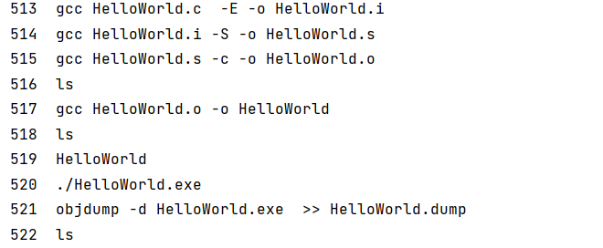

##   程序执行
#### gcc HelloWorld.c  -E -o HelloWorld.i   // 预处理
#### gcc HelloWorld.i  -S -o HelloWorld.s   // 编译 转换成汇编程序
#### gcc HelloWorld.s  -c -o HelloWorld.o   // 汇编 转换成可链接的二进制程序
#### gcc HelloWorld.o -o HelloWorld

#### gcc HelloWorld   -o HelloWorld

#### ./HelloWorld.exe

#### objdump -d HelloWorld.exe  >> HelloWorld.dump
